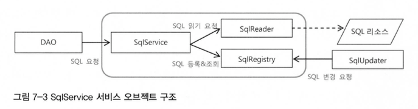
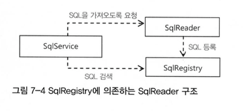

#스프링 핵심 기술의 응용
##Spring Study 7.1 ~ 7.4 

###7.1 SQL과 DAO의 분리
SQL은 빈번하게 수정 될 수 있으므로 DAO에서 이를 XML을 이용한 분리

#####1. userDao 빈 설정파일에 추가하기

<property name = "dataSource" ref="dataSource" />
<property name = "sqlAdd" value="insert into users..." />


단점 : 많아지면 추가가 귀찮아짐

#####2. SQL 맵 프로터피 방식

<bean id="userDao" class="springbook.user.dao.UserDaoJdbc"><property name = "dataSource" ref="dataSource" />
	<property name = "sqlMap">
		<map>
    		<entry key ="add" value="insert into users..." />
        	<entry key ="get" value="select * from users..." />
        ...
    	</map>
    </property>
</bean>


단점 : 메소드가 실행 전에 오류확인이 힘듬

#####3. 외부시스템에서 가져오기
1. SQL 서비스 인터페이스 구현
	* 메소드에서 예외 던지기 (런타임)
2. SqlService 인터페이스를 통해 SQL을 가져오도록 수정
	* UserJDBC에서 SqlService를 DI
	* UserDao가 SqlService를 통해 SQL 가져오기
3. userDao가 DI 받아 사용 할 수 있도록 빈 설정

###7.2 인터페이스의 분리와 자기참조 빈
#####1. XML 파일 매핑
1. JAXB
	* XML -> 오브젝트로 맵핑 시켜줌
	* JAXB 컴파일러로 컴파일이 필요함
		* xjc -p springbook.user.sqlservice.jaxb sqlmap.xsd -d src
	* 바인딩 된 두개의 클래스가 만들어짐 (예시의 경우)
2. JAXB 언마샬링
	* 언마샬링 : XML -> 오브젝트
	* 마샬링 : 오브젝트 -> XML
	* 사용법은 알아서들...
3. 빈 초기화 작업
	* 생성자에서 복잡한 초기화 작업을 다룸
		1. 예외를 다루기 힘듬
		2. 상속하기 불편
		3. 보안상 문제 발생
	* **빈 후처리기** 를 활용해서 빈을 생성한 뒤 부가작업 수행
	* Spring에서는 **@PostConstruct** 제공

4. 인터페이스 분리
	* XML이 아닌 다른 포맷에서 읽어온다면?? 그러면 다 뜯어 고쳐야됨
	* 서로 관심이 다른 코드를 분리하고, 서로의 코드에 영향을 주지 않으면서 유연하게 확장 가능하도록 **DI**를 적용해보자
	* 책임에 따른 인터페이스 정의
		* SQL 정보를 외부로 부터 리소스를 읽어오는 기능 -> SqlReader
		* SQL을 보관해두고 있다가 필요할 때 제공하는 기능 -> SqlRegistry
            <figure class="half">
                
            </figure>
		* DI로 Reader는 Registry를 전달 (코드에 의한 수동DI)
		* SqlReader는 SqlRegistry에 의존적
            <figure class="half">
                
            </figure>
	* 자기참조 빈
		* 인터페이스가 3개!!!
            <figure class="half">
                
            	<figcaption>7-5 SqlService의 클래스와 의존관계</figcaption>
            </figure>

            * XmlSqlService는 SqlService를 구현하고 SqlReader와 SqlRegistry를 포함

		* 3개를 전부 Implement
            <figure class="half">
                
            	<figcaption>7-6 세개의 인터페이스를 구현하는 XmlSqlService</figcaption>
            </figure>

            * XmlSqlService는 인터페이스를 통해 접근하도록 인터페이스에 의존적으로 만듬
            * 구현을 하고 자기자신을 참조하는 빈 설정
            
			<property name = "sqlReader" ref="sqlService" />
			<property name = "sqlRegistry" value="sqlService" />
			

	* 확장 가능한 기반 클래스
		* SqlRegistry와 SqlReader를 제거

###7.3 서비스 추상화 적용
* 필요에 따라 다른 기술로 손쉽게 바꾸기 위함
* 임의의 클래스 패스, 파일시스템 절대경로, HTTP 등으로 가져오기

#####1. OXM 서비스 추상화
1. XML 파서간 상호호환성이 있음 이를 이용 인터페이스 만들기
	* javax.xml.transform.Source가 상호호환을 가능하게 하는듯
	* Castor 구현 부분은 패스

2. OXM 서비스 추상화 적용
	* 위에 SqlReader가 OxmlSqlReader로 변경
        
        public class OxmSqlService implements SqlService{
        private final OxmSqlReader oxmSqlReader = new OxmSqlReader();

        private class OxmSqlReader implements SqlReader {}
        }
        
    	* OxmSqlReader는 외부에서 접근 불가능 (final)
    	* 이를 final로 선언하고 생성하기 때문에 DI 및 변경 불가능
    	* 구조 최적화 및 빈등록과 설정이 쉬워짐
    	* 그림 7-8 참조
    	* [코드링크](https://github.com/kenu/tobyspring31/blob/master/v1chap07/src/springbook/user/sqlservice/OxmSqlService.java)

	* 위임을 이용한 BaseSqlService의 재사용
    	* 문제점
        	* loadSql()과 getSql()이 BaseSqlService와 동일
            * OxmSqlService를 만들때 재사용을 위해 Base를 상속해서 만들면 OxmSqlReader를 생성하는 코드를 넣기가 애매함
            * loadSql() 및 getSql() 수정이 자주, 복잡하면 실수 할 가능성이 높아짐
            * 앞에서 다룬 BaseSqlService에 SqlReader와 SqlRegistry를 포함시켜둔 것을 활용

3. 리소스 추상화
	* 문제점 : 같은 클래스패스에 존재하는 파일로 제한됨
	* 리소스에 대한 통일된 방법으로 다양한 곳에서 SQL 맵을 가져올 수 있도록 수정
	* Spring에는 이미 Resource 인터페이스가 정의되어 있음 외부의 정보를 가져올 때 항상 이 Resource를 이용
	* prefix를 통해 ResourceLoader가 가져옴
	* Resource 가져오는 부분을 ResourceLoader를 통해 가져오게 코드를 변경하고 XML에 prefix를 지정하면 됨

