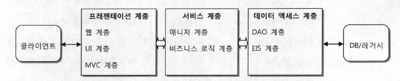

# 스프링 프로젝트 시작하기
## 1. 자바 엔터프라이즈와 스프링 어플리케이션
1.	클라이언트 & 백엔드
	* 클라이언트 
		* 웹 브라우저(HTML)
		* RIA(Rich Internet Aplication),
		* HTTP 프로토콜을 사용하는 다른 엔터프라이즈 시스템
	* 백엔드
		* DB
		* 메시징 서버
		* 메일 서버
		* 메인 프레임

2. 어플리케이션 서버
	* 경량급 WAS / 서블릿 컨테이너 
		* 톰캣이나 제티
		--> EJB나 리소스 커넥터, WAS의 분산 서비스등이 필요 없을때
		* 핵심기능 모두 이용 가능하며 추가 기능은 라이브러리 사용
	* WAS
		* 안정성, 고성능 시스템을 위한 리소스 관리
		* 레거시 시스템 연동
		* 다수 서버 모니터링에 유리
		* Java EE 최대한 활용 가능
		* WAS를 구매하기 부담스러우면 tcServer를 써라

3. 배포 단위
	https://yang1650.tistory.com/44

	* 독립 웹 모듈 (war)
	* 엔터프라이즈 애플리케이션 (ear)
		* EJB 모듈을 긴밀하게 사용하거나 반대로 EJB 모듈에서 스프링으로 만든 애플리케이션을 이용해야 할때
	* 백그라운드 서비스 모듈 (rar)
		* UI 없이 백그라운드 서비스처럼 동작할 필요가 있을 때
		* WAS가 반드시 필요함

## 2. 개발도구와 환경
1. Java EE와 SE 차이점
	* <https://210life.tistory.com/entry/Java-EE%EC%99%80-Java-SE%EC%9D%98-%EC%B0%A8%EC%9D%B4%EC%A0%90/>

2. IDE
	* Eclipse, Netbeans, IntelliJ
	* IntelliJ 단축키 : <https://resources.jetbrains.com/storage/products/intellij-idea/docs/IntelliJIDEA_ReferenceCard.pdf/>
	* IntelliJ 팁
	<https://www.popit.kr/%EC%9D%B8%ED%85%94%EB%A6%ACj-%ED%99%9C%EC%9A%A9-%EA%BF%80%ED%8C%81-42%EA%B0%80%EC%A7%80-%EC%A0%95%EB%A6%AC/>

3. 라이브러리와 관리
	* 라이브러리 관리의 어려움
		* 라이브러리 간의 의존성 문제
			--> 재패키징으로 해결
	* 라이브러리 선정
		* 스프링 모듈
		* 라이브러리 : 의존성 파악해서 잘 선정
	* 빌드툴과 라이브러리 관리
		* IDE를 통한 자동 빌드 + 환경에 독립적인 빌드 툴
			* Maven
			* Ant

## 3. 어플리캐이션 아키텍쳐
### 계층형 아키텍쳐
* 결합도를 낮추기 위한 DI --> 더 큰 아키텍쳐 레벨에 적용
	* 오브젝트 --> 모듈로 생각
	* 비슷한 성격과 책임을 가진 것들끼리 묶음
		* 요청정보
		* 서비스
		* DAO
	* 책임과 성격이 다른 것을 크게 그룹으로 만들어 분리해두는 것을 **계층형 아키텍쳐**라 부름 혹은 **멀티 티어 아키텍쳐**
	* 웹 기반의 어플리캐이션은 일반적으로 3개층을 갖는다해서 **3-tier 애플리케이션** 이라고 함

2. 3계층 아키텍쳐와 수직계층
	<figure class="half">
	
	<figcaption>3계층 아키텍처 </figcaption>
 	</figure>

	* **데이터 엑세스 계층 **
		* DAO 계층이라 불림
		* EIS (Enterprise Information System) 계층이라고도 함
		* 사용 기술에 따라 다시 세분화 됨
		<figure class="half">
			
 		</figure>
 		* JDBC Template통해 JDBC, 드라이버, 트랜잭션 동기화를 간접적으로 사용 하도록 만듬

	* **서비스 계층**
		* 가장 단순한 구조
		* POJO로 작성 됨 : 비즈니스 로직의 핵심, 쉽게 테스트하고 유연하게 확장 가능
		* 특별한 경우가 아니라면 추상화 된 수직 계층구조를 가질 필요 없음 API를 직접 다루는 코드가 아니기 때문임
		
		<figcaption>서비스 계층과 기반 서비스 계층 </figcaption>
 		</figure>
 		* 서비스 계층이 기반 서비스 계층의 구현에 종속되면 안됨
 		--> 이를 추상화된 서비스 인터페이스를 통해 접근하도록 만들어야함

	* ** 프레젠테이션 계층 **
		* 가장 복잡한 계층
		* 매우 다양한 기술과 프레임워크의 조합을 가질 수 있음

3. 계층형 아키텍처 설계의 원칙
	* 각 계층은 응집도가 높으면서 다른 계층과 낮은 결합도 유지
	
    * ** 메소드 문제점 **
    *	
			public ResultSet findUsersByName(String name) thorws SQLException;
		
		* 데이터 엑세스 계층의 기술과 그 역할을 다른 계층에 노출
		* ResultSet이라는 JDBC의 오프젝트를 돌려줘서 서비스 계층에서 이를 직접 다뤄야함
		* SQLException (checkedException) 이라는 JDBC의 예외를 서비스 계층에서 분석 처리해야함

	* ** 메소드 문제점 해결 **
	*	
			public List<User> findUsersByName(String name) thorws DataAccessException;
		
		* 단순 오브젝트 제공으로 특정 계층의 기술이나 구현에 종속 X
		* 데이터 엑세스 예와 같이 특별한 경우에 대하여 DataAccessException과 같은 Runtime 예외 제공
		--> 이를 통해 존재를 무시하도록 만들어야함
	* 프레젠테이션 계층의 오브젝트를 서비스 계층에 그대로 전달하지 말 것
		* (EX) HttpServletRequset, HttpServletResponse, HttpSession 같은 타입을 파라메터로 사용하면 안 됨

	* ** 계층 사이의 호출은 인터페이스를 통해 결합도를 낮춰라! **
	* 한 계층의 내부에서만 쓰는 빈을 다른 계층에서 쓰지 마라

### 어플리케이션 정보 아키텍쳐
* 엔터프라이즈 시스템은 동시에 많은 작업이 빠르게 수행되어야 함
	* 간단한 상태만 유지
	* 주요 상태는 클라 or 백엔드에 분산
	* 장기 보관 상태는 DB에 메인프레임
	* 임시 상태는 클라 or 서버의 사용자 세션별 메모리

1. 데이터 중심 아키텍처
	* 정보를 값이나 값을 담기 위한 오브젝트 형태로 취급하는 구조
	* 비즈니스 로직이 저장 프로시저 혹은 SQL에 담겨있는 경우가 많음
	* DB에서 온 내용은 맵이나 오브젝트에 담아서 전달

2. DB/SQL 중심의 로직 구현 방식
	*  하나의 업무 트랙잭션에 모든 계층의 코드가 종속
	*  검색은 SQL로 만들어짐
	*  결과는 오브젝트에 저장
	*  ** 단점 **
        *  종속적이고 배타적이어서 다른 단위 업무에 사용되기 힘듬
        *  작업 단위에 대부분 1:1 맵핑되어 코드 중복이 되기 쉬움
        *  자바 코드가 단지 DB와 화면을 연결해주는 단순 인터페이스 역할으로 전락함
        *  SQL 변화가 일어나면 SQL 결과에 종속적이기 때문에 비즈니스 로직도 변경이 되어야 함

	* ** 장점 **
		*  개발이 쉬움
		*  코드 생성기를 통해 자동화에 유리함
		*  개발자들끼리 서로 독립적인 기능을 만들기 편함

3. 거대한 서비스 계층 방식
DB에서 가져오긴 하지만 어플리케이션 코드의 비중을 높이는 방법
	* DB 부하를 막기 위해 저장 프로시저 사용 X
	* 복잡한 SQL을 피함
	* 주요 로직은 서비스 계층의 코드에서 처리하도록 만듬
	* ** 장점 **
		* 서비스 계층에 코드 재사용 가능
		* DAO와 SQL이 비교적 단순해짐
		* 1:1로 맵핑 되지 않아 DAO를 공유 해서 쓸 수 있음
		* 핵심 로직이 자바 코드에 있어 테스트 용이

	* ** 단점 **
		* 메소드가 매우 거대해짐
		* 서비스 계층의 코드는 여전히 업무 트랜잭션 단위로 집중되어 코드의 중복이 다수 발생
		* 개발자간 코딩컨벤션이 안 맞을 수 있음

